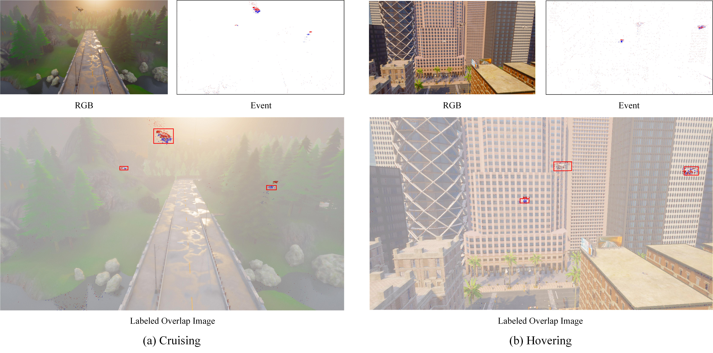

# REDD
The REDD dataset is a spatially and temporally aligned RGB-Event dataset for multi-drone detection simulated in the CARLA environment. The dataset will be made publicly available upon publication of the paper.

REDD provides strictly spatiotemporally aligned RGB-Event data pairs with flawless calculated 2D bounding-box annotations. Furthermore, REDD incorporates challenging operational scenarios, such as complex background interference and drone hovering, along with diverse flight trajectories, thereby establishing a comprehensive and robust foundation for developing and evaluating highly robust UAV perception algorithms.

